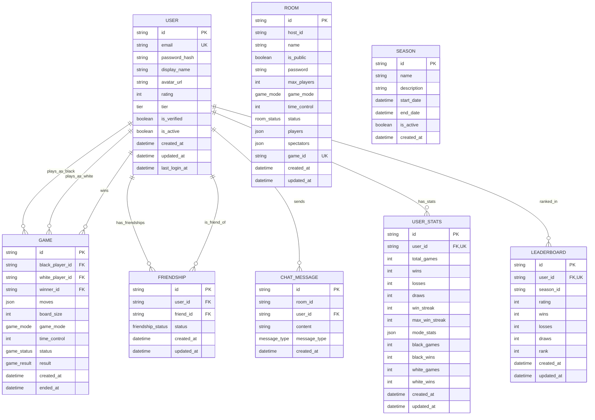

# 数据库 ER 图

## 实体关系图



## 表关系说明

### 1. User - Game 关系
- 一个用户可以参与多局游戏（作为黑方或白方）
- 一个用户可以赢得多局游戏
- 游戏记录存储双方玩家ID和获胜者ID

### 2. User - Friendship 关系
- 用户之间可以建立双向的好友关系
- 好友关系有状态：待接受、已接受、已屏蔽
- 使用联合唯一约束防止重复好友关系

### 3. User - UserStats 关系
- 一对一关系：每个用户有且仅有一条统计记录
- 统计包含总战绩、连胜记录、黑白方胜率等

### 4. User - Leaderboard 关系
- 按赛季存储排名数据
- 用户可以出现在多个赛季的排行榜中
- 当前赛季数据用于实时排名

### 5. User - ChatMessage 关系
- 一个用户可以发送多条消息
- 消息按房间ID分组（大厅或具体房间）

## 数据流

### 游戏对局流程
```
1. 创建房间 → Room 表
2. 开始游戏 → Game 表创建记录
3. 玩家落子 → moves JSON 更新
4. 游戏结束 → 更新 Game 状态，触发 Stats 更新
5. 如果是排位赛 → 更新 Leaderboard
```

### 用户注册流程
```
1. 创建 User 记录
2. 创建初始 UserStats 记录
3. 如果是赛季中 → 创建 Leaderboard 记录
```

## 查询示例

### 获取用户游戏历史
```sql
SELECT g.*,
       black.display_name as black_name,
       white.display_name as white_name
FROM games g
JOIN users black ON g.black_player_id = black.id
JOIN users white ON g.white_player_id = white.id
WHERE g.black_player_id = ? OR g.white_player_id = ?
ORDER BY g.created_at DESC
```

### 获取排行榜
```sql
SELECT l.*, u.display_name, u.avatar_url
FROM leaderboards l
JOIN users u ON l.user_id = u.id
WHERE l.season_id = ?
ORDER BY l.rating DESC
LIMIT 100
```

### 获取好友列表
```sql
SELECT u.id, u.display_name, u.avatar_url, u.rating, u.is_active
FROM friendships f
JOIN users u ON f.friend_id = u.id
WHERE f.user_id = ? AND f.status = 'ACCEPTED'
```
